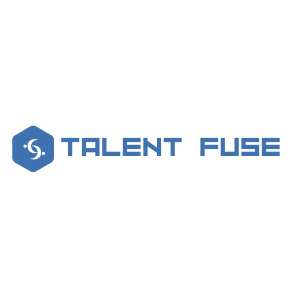

# はじめに

\*この物語はフィクションです。

## 導入

株式会社 POPY グループは、全国に 30 の拠点を持ち、グループ連結従業員が 30 万人にのぼる家電業界の大企業である。
新型コロナウイルスの蔓延以降、巣ごもり需要により急成長を遂げ、企業規模も拡大した。

 

POPY グループでも、従業員の安全のためリモートワークを導入した。しかし、リモートワークの導入により、従業員同士の直接的なコミュニケーションの機会が減少し、また、企業規模の急激な拡大に伴い、社内であっても知らない人が多くいるという問題が生じた。

 

この問題に対し、SaaS 企業であるドリーム・アグリゲーションが、自社で開発しているタレントマネジメントシステム「Talent Fuse」の導入を提案。
タレントマネジメントシステムは、社内の従業員の情報やスキル、経験などを一元管理できるシステムである。
上記に加え、「Talent Fuse」には目玉機能として従業員同士をランダムにマッチングさせてグループを作成する機能がある。これは、例えば直接の関わりのない他チームのリーダーとの 1on1 をセッティングしたり、社内のランダムなメンバーでグループを作成し、雑談やグループワークを行ってもらう目的で開発された。

 

SaaS サービスであるためインフラ管理を考える必要がなく、また目玉機能である「マッチンググループ」が評価され、無事 POPY グループでの採用が決まった。

しかし、導入から 3 年が経ち、サービスのパフォーマンスに関するサポートへの問い合わせが急増した。
サービス利用者の拡大に伴い、パフォーマンス問題が頻発。既に先方の業務で深く使ってもらっていることもあり、業務への影響も大きく、営業やサポートは謝罪の毎日。

 

この状況に対し、週末にサービス提供を一時中断しその間にパフォーマンス改善を実施する方向で先方と合意。ドリーム・アグリゲーション社内の精鋭を集め、専用の「パフォーマンス改善チーム」を結成することになった。

 

営業メンバー及び CTO の尽力により、なんとかサービスの緊急メンテナンス期間を確保できたが、その期間は 42 時間。この間にパフォーマンスを改善し、サービスの立て直しをすることが、チームのミッションである。

[次へ](./01_Service.md)
