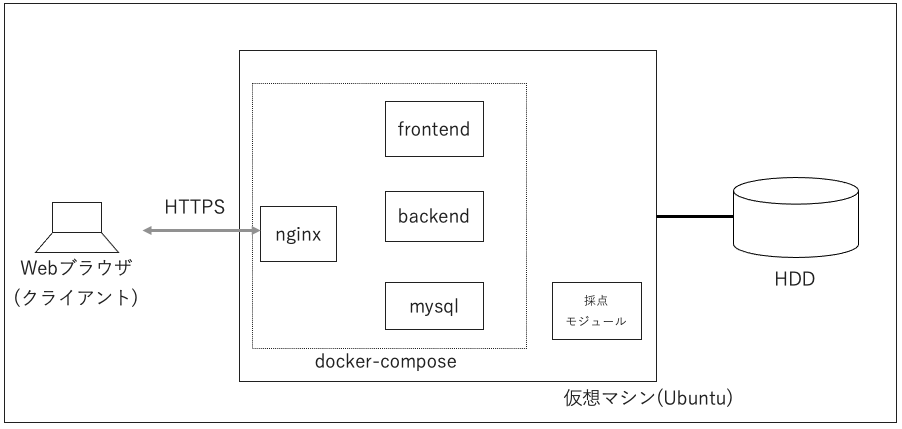
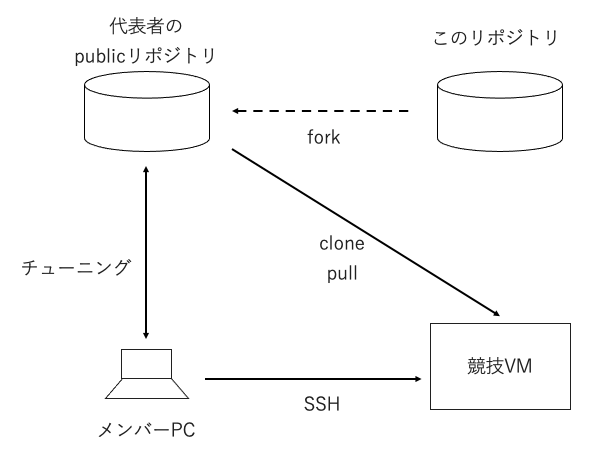

# 競技の概要と環境

## 競技概要

規定時間までに、課題アプリケーションである「Talent Fuse」のバックエンドをチューニングし、パフォーマンスを改善してください。

各チームは専用の採点モジュールを使ってパフォーマンスを採点できます。課題提出の締め切りまでに運営に送信されたスコアが最も高いチームが優勝です。

上位入賞グループには、

- どのようにチューニングしたか
- どのような役割分担、方針で進めたか

を発表していただく予定です。

レギュレーションは別文書にまとめています。

## 競技環境構成

 

DB サーバと AP サーバが同居の 1VM 構成です。

サービスは docker compose 上の複数のコンテナによって構成されてます。各コンテナの役割は以下の通りです。

- nginx: SSL 終端、及びリクエストの frontend または backend への振り分け
- mysql: ファイル以外のユーザ情報を保管
- frontend: Next.js + Typescript で実装、ビルドされた html/javascript コードを提供
- backend: クライアント向けの API を提供 (一部フロントエンド用の API を含む)。Express + Typescript で実装

Web ブラウザは frontend からのコードを実行し、クライアントとして動作します。

クライアントは backend から提供された API を利用することで、ユーザに機能を提供します。

サービス利用が開始されているため、ユーザー・部署・役職などのデータや添付ファイル等はすでに登録されているものとします。

\*本競技では、クライアント側は改善対象ではありません。

## 競技の進め方

 

このリポジトリを、チームの代表者 1 名の Github アカウントの Public リポジトリにフォークしてください。チューニング結果をフォークしたリポジトリの main ブランチにコミットしてください。

チーム毎に 1 つずつ環境を用意しています。配布される環境 ID、および秘密鍵で VM に SSH ログインできます。

チューニングした結果を fork リポジトリから pull して VM 内で実行、採点できます。

[次へ](./03_Rule.md)
